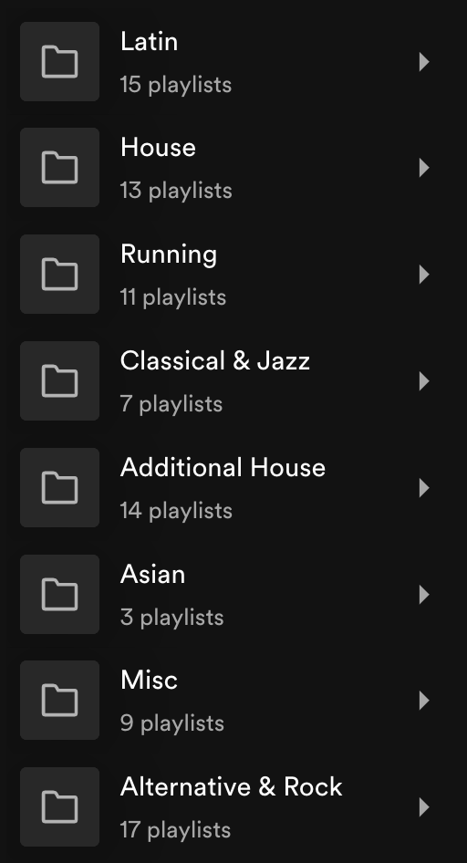

<!-- PROJECT LOGO -->
 

  

<h3 align="center">Object Oriented Spotify</h3>

  

    A powerful spotify playlist manager with OOP principles
     
    <a href="https://github.com/ivanearisty/ObjectOrientedSpotify/tree/main/src/main/java/io/suape/ObjectOrientedSpotify"><strong>Explore the docs »</strong></a>
     
     
    <a href="https://github.com/github_username/repo_name">View Demo</a>
    ·
    <a href="https://github.com/github_username/repo_name/issues">Report Bug</a>
    ·
    <a href="https://github.com/github_username/repo_name/issues">Request Feature</a>
  

<!-- TABLE OF CONTENTS -->

  
Table of Contents

  <ol>
    <li>
      <a href="#About-The-Project">About The Project</a>
      <ul>
        <li><a href="#built-with">Built With</a></li>
      </ul>
    </li>
    <li>
      <a href="#getting-started">Getting Started</a>
      <ul>
        <li><a href="#prerequisites">Prerequisites</a></li>
        <li><a href="#installation">Installation</a></li>
      </ul>
    </li>
    <li><a href="#usage">Usage</a></li>
    <li><a href="#roadmap">Roadmap</a></li>
    <li><a href="#license">License</a></li>
    <li><a href="#contact">Contact</a></li>
  </ol>

<!-- ABOUT THE PROJECT -->
## About The Project
Currently, the app is under development, but the following is a 
brief explanation of the project goals.  

This is a Spotify management app for DJs and power users built upon three concepts:  

- Playlist specific basics: song sorts and filters (by bpm, track 
name, length, key, artists, etc...). 
- Inter-playlist basics: playlist merges, splits, exports, and imports. 
- The identity of the app: an enforcement of a new object-oriented design approach to playlist management for your selected playlists. It allows you to create lose or strict child-parent relationships to save time on playlist creation, management, maintenance, and organization by leveraging inheritance. Also, you get to create abstract playlists (invisible to spotify), which can represent collections of songs to be implemented by real spotify playlists.

TODO:
For more details please see:
- [Tech Stack and Architecture](https://github.com/ivanearisty/ObjectOrientedSpotify/blob/4d198169c109525ecd268379d7463a4a987465fe/research/Tech%20Stack%20and%20Architecture.md)
- [Database Model](https://github.com/ivanearisty/ObjectOrientedSpotify/blob/1db9f1cf2ab944eb7bc5d34eaa3090f9f6852591/research/Database_Model.md)
- [Technical Spec & Requirements](https://github.com/ivanearisty/ObjectOrientedSpotify/blob/cb67e178aaf7411c24c9f0e7d33322884cd7f0b2/research/Technical_Requirements.md)
- [All other research](research) 

(<a href="#readme-top">back to top</a>)

### Built With

[![Java][Java.com]][Java-url]
[![Spring][Spring.io]][Spring-url]
[![SpringSecurity][SpringSecurity.com]][SpringSecurity-url]
[![MySQL][MySQL.com]][MySQL-url]
[![AWS][AWS.com]][AWS-url]
[![Angular][Angular.io]][Angular-url]
[![TypeScript][TypeScript.org]][TypeScript-url]
[![Bootstrap][Bootstrap.com]][Bootstrap-url]
[![RxJs][RxJs.dev]][RxJs-url]
[![Docker][Docker.com]][Docker-url]

(<a href="#readme-top">back to top</a>)

<!-- GETTING STARTED -->
## Getting Started

This app is currently in development

<!-- USAGE EXAMPLES -->
## Usage

### Purpose 
I consider myself a Spotify power user. I have over 100 public playlists that are all meticulously created to fit a theme. My Spotify is generally divided into the `main` folder that contains all my public playlists in their appropriate sub-folders, a `protected` folder that contains all private playlists I have “on hold,” a SETS folder for private playlists I use for my DJ Sets, and a Spotify folder containing all playlists not created by me in an arbitrary order.

This webapp not only allows the user to replicate the system I have developed, but it also provides more features to make managing and expanding their Spotify library easy.

The basic features are similar to those of [Sort Your Music](http://sortyourmusic.playlistmachinery.com/), but expanded. Sorting of playlists by each track's name, artist, release, bpm, energy, length, popularity, and random. You can sort by each of these columns or fields into ascending, descending, or default (do nothing). Also, you can filter songs by multiple parameters. Finally, you can save sorted playlists as a new ones, merge existing playlists, split existing playlists, and export/import them.

### Inheritance in Spotify

Every playlist using inheritance follows a similar naming convention:

Genre (SubGenre) extends (SubGenre) implements (an unimplemented, aka abstract, or real SubGenre)

You can see the inspiration of Java naming conventions very clearly, because I came up with this system years ago while learning Java. Thankfully, the naming conventions have been very powerful in letting me organize subsets of playlists.

Genres are abstract concepts that encompass playlist categories (the equivalent of spotify folders)

SubGenres are just regular playlists, but they can also be abstract playlists living in the webapp environment. They are the ones directly affected by inheritance.

When a playlist (or SubGenre) implements another it will use every song in it no matter what. Also, a playlist can implement an idea. Maybe you want to create a playlist that has a LOT of music from a certain label (or a band), but you find an unrelated song that fits that label’s sound and you also don’t want to actually create a SubGenre of just this label. So, you create a SubGenre that implements the idea of the label’s name.

Here are some examples:  
(Main) is a real playlist that contains the entire discography of the Arctic Monkeys, but also implements (TLSP). (TLSP) contains songs from lead vocalist Alex Turner of the Arctic Monkeys, but with another band.

(Cawabonga) is implementing (Rawsome), which is a music label with a very distinctive sound.

Here, both playlists below are implementing (Parcels), which is a band. (Parcels) is an abstract playlist that can contain 0 songs or a few songs you want any song that contains parcels to have, like your favorite song by them.

The playlist underneath extends Conventional because it inherits a lot of the songs but overrides (or omits) a lot of them.

Extending a playlist (SubGenre) means that either:  
- 20% or more of the songs in this playlist are also present in the extended playlist  
- 20% or more of the songs in the extended playlist are also present in this playlist

Implementing a playlist (SubGenre) means that:
- 100% of the songs in the implemented playlist must be present in this playlist

For more information about this visit [Technical Requirements](research/Technical_Requirements.md).

(<a href="#readme-top">back to top</a>)

<!-- ROADMAP -->
## Roadmap

- [x] Create outline of app requirements
- [x] Design SQL database
- [x] Design rough design of backend and frontend structure
- [ ] Implement Minimum Backend 
  - [x] Implement User repository
  - [ ] Spring Security configuration
  - [ ] Login functionality with Spotify
  - [ ] User authorization filters
  - [ ] Implement reset password feature
  - [ ] Account verification
  - [ ] Refresh tokens
- [ ] Implement Minimum Frontend
  - [ ] Login Page
  - [ ] Login with Spotify
  - [ ] JWT
  - [ ] User password update
  - [ ] User account settings
- [ ] Fully Implement Backend Repositories
    - [ ] Implement Playlist Repository
    - [ ] Implement Tracks Repository
    - [ ] Implement Abstract Playlists Repository
- [ ] Finalize Business logic and services
- [ ] Design all frontend
- [ ] Sync frontend with backend services and Deploy

Some features for the future are:
- Graphs of song specific attributes across the playlist to measure energy levels and other song traits
- Ability to optimize for smoothness or discrete jumps in energy, instrumental, acoustic, vocal, etc... in a playlist
- AI generator for description of playlists
- Genre analyzer (scrapping or AI with waveforms like serato and rekordbox)
- AI playlist generations by waveform analysis. Beyond the scope most definitely because this would be extremely resource intensive, but interesting to implement.
- A “now playing” integration, probably with web-sockets.
- Cross-platform listening parties (the reason why we want web-sockets above).
- Multi-user functionality for concurrent edits to the same account.w
- Multi-platform sync for services like Apple Music, YouTube music, and Deezer

<!-- CONTACT -->
## Contact

Ivan Aristy - iae225@stern.nyu.edu

(<a href="#readme-top">back to top</a>)

<!-- MARKDOWN LINKS & IMAGES -->
<!-- https://www.markdownguide.org/basic-syntax/#reference-style-links -->
[Java.com]: https://img.shields.io/badge/Java-ED8B00?style=for-the-badge&logo=openjdk&logoColor=white
[Java-url]: https://www.java.com/en/
[Spring.io]: https://img.shields.io/badge/Spring-6DB33F?style=for-the-badge&logo=spring&logoColor=white
[Spring-url]: https://spring.io/
[SpringSecurity.com]: https://img.shields.io/badge/Spring_Security-6DB33F?style=for-the-badge&logo=Spring-Security&logoColor=white
[SpringSecurity-url]: https://spring.io/projects/spring-security
[MySQL.com]: https://img.shields.io/badge/MySQL-005C84?style=for-the-badge&logo=mysql&logoColor=white
[MySQL-url]: https://www.mysql.com/
[AWS.com]: https://img.shields.io/badge/Amazon_AWS-232F3E?style=for-the-badge&logo=amazon-aws&logoColor=white
[AWS-url]: https://aws.amazon.com/rds/
[Angular.io]: https://img.shields.io/badge/Angular-DD0031?style=for-the-badge&logo=angular&logoColor=white
[Angular-url]: https://angular.io/
[TypeScript.org]: https://img.shields.io/badge/TypeScript-007ACC?style=for-the-badge&logo=typescript&logoColor=white
[TypeScript-url]: https://www.typescriptlang.org/
[Bootstrap.com]: https://img.shields.io/badge/Bootstrap-563D7C?style=for-the-badge&logo=bootstrap&logoColor=white
[Bootstrap-url]: https://getbootstrap.com
[RxJs.dev]: https://img.shields.io/badge/rxjs-%23B7178C.svg?style=for-the-badge&logo=reactivex&logoColor=white
[RxJs-url]: https://rxjs.dev 
[Docker.com]: https://img.shields.io/badge/docker-%230db7ed.svg?style=for-the-badge&logo=docker&logoColor=white
[Docker-url]: https://www.docker.com/

