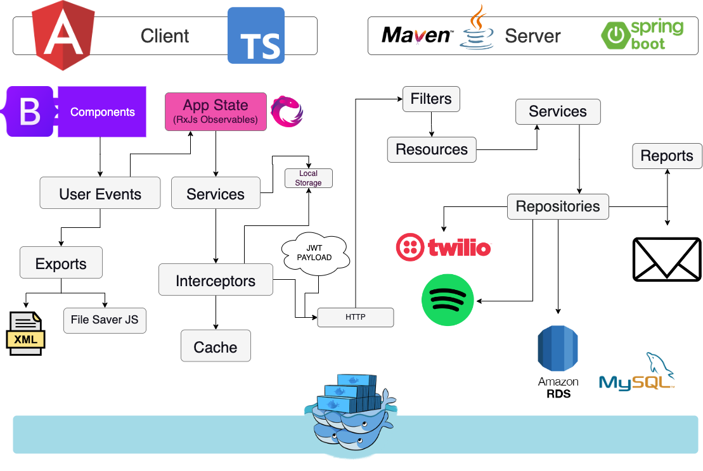

We will be following a DDD model. Knowledge is based on these articles:

- https://en.wikipedia.org/wiki/Multitier_architecture
- https://en.wikipedia.org/wiki/Business_logic
- https://learn.microsoft.com/en-us/dotnet/architecture/microservices/microservice-ddd-cqrs-patterns/infrastructure-persistence-layer-design
- https://en.wikipedia.org/wiki/Domain-driven_design
- https://softwareengineering.stackexchange.com/questions/330428/ddd-repositories-in-application-or-domain-service
- https://softwareengineering.stackexchange.com/questions/323686/what-layer-should-contain-interactions-with-external-or-remote-resources-which-a
- https://medium.com/@enocklubowa/why-you-need-to-use-dtos-in-your-rest-api-d9d6d7be5450#:~:text=The%20Domain%20layer%20defines%20the,by%20the%20underlying%20Domain%20object.

So, in essence, I want to create a couple of layers to handle everything.

At the time of writing, I am working on the backend. So, I plan to have:

- Presentation layers and frontend
- Service layer for Data Transfer Objects
- Data Transfer Object mappers and classes 
- The Domain layer defines the actual business data involved in the application. For example for a User, we have all data stored about them defined here.
- Repository layer for communicating with the database and
- Exceptions layer (I don’t know if this should even be a layer)
- Infrastructure layer (will handle communication with external APIs)

The following is an AI assisted summary of some of the layers:

**Domain Layer:**
The Domain Layer is a fundamental part of the application's architecture, focusing on modeling the core business logic and rules. In the context of the application that interacts with the Database, Spotify API, Twilio, and an email API, the Domain Layer will encompass the following responsibilities:

1. **Business Logic:** This layer will hold the application's core business rules and logic, ensuring that the software processes align with the real-world domain. For instance, the logic for user authentication, playlist management, and multi-factor authentication (MFA) will be defined here.
2. **Entities:** The Domain Layer will define entities that represent the key concepts of your application, such as Users, Playlists, and AuthenticationTokens. These entities encapsulate both behavior and state.
3. **Aggregates:** In the context of DDD, aggregates are clusters of related entities that are treated as a single unit. For instance, a User aggregate might include the User entity along with related entities like Playlists. This helps to maintain consistency and ensure proper encapsulation of business rules.
4. **Value Objects:** Value objects represent components of your application that are identified solely by their attributes, without any conceptual identity. For example, the attributes of an email address or a phone number could be represented as value objects.
5. **Domain Events:** Domain events represent important occurrences in the domain that need to be captured for various purposes. For instance, an event might be triggered when a new user is registered or when a playlist is created.

**Repository Layer:**
The Repository Layer is responsible for handling the interactions between the Domain Layer and external data sources, such as databases, APIs, or caches. Here's how the Repository Layer will be structured in your application:

1. **Data Mapping:** The Repository Layer will mediate between the Domain Layer and the data sources, mapping data from external sources into domain models. For instance, when interacting with the Spotify API, the repository would handle the conversion of API responses into domain entities like Users and Playlists.
2. **Caching:** If caching is employed in your application to improve performance, the Repository Layer will encapsulate the caching mechanism. The Domain Layer doesn't need to be concerned with caching details.
3. **Concurrency:** The Repository Layer should ensure concurrency safety, especially when dealing with cached data or handling multiple concurrent requests that need access to the same data. Modern concurrency mechanisms like coroutines can be employed for this purpose.
4. **Single Source of Truth:** The Repository Layer serves as the single source of truth for domain models across the application. It ensures that consistent data is provided to the Domain Layer, preventing potential data inconsistencies that might arise from multiple sources.

**Communication Between Layers:**
The communication between the Domain Layer and the Repository Layer will primarily revolve around the following interactions:

1. **Data Retrieval:** The Domain Layer will request data from the Repository Layer using methods like `getUserByID` or `getPlaylistByID`. The Repository Layer will then fetch the data from external sources and perform necessary data mapping.
2. **Data Modification:** When the Domain Layer needs to modify data, such as updating a playlist or creating a new user, it will invoke methods in the Repository Layer, such as `updatePlaylist` or `createUser`. The Repository Layer will handle the necessary interactions with external data sources to persist the changes.
3. **Concurrency Control:** If concurrency is involved, the Repository Layer will ensure that data updates are handled in a thread-safe manner, preventing race conditions.
4. **Caching:** If caching is used, the Repository Layer will manage cache interactions, ensuring that cached data remains consistent with the external data sources.

In summary, your application's Domain Layer will encapsulate the core business logic and rules, while the Repository Layer will handle data interactions with external sources, including data mapping, caching, and concurrency control. The two layers will communicate to provide a seamless and consistent experience for your application's users while maintaining separation of concerns and adhering to DDD principles.